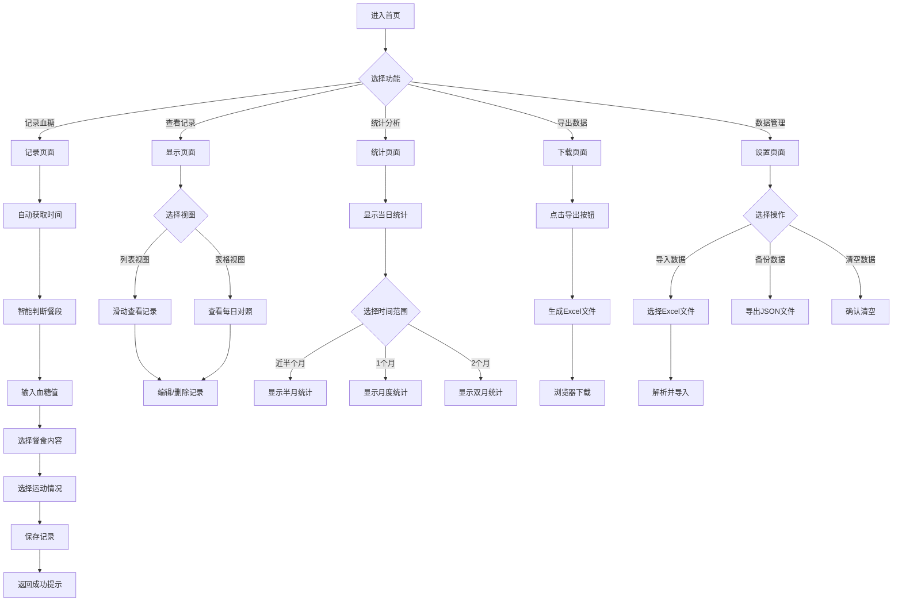

## 1. Product Overview

妊娠期血糖记录H5应用，为孕妇提供便捷的血糖数据记录、查看、统计和导出功能。基于血糖仪测量数据，帮助用户跟踪孕期血糖变化，及时发现异常情况。

## 2. Core Features

### 2.1 User Roles
| Role | Registration Method | Core Permissions |
|------|---------------------|------------------|
| 普通用户 | 无需注册 | 记录、查看、统计、导出血糖数据 |

### 2.2 Feature Module
1. **记录页面**：获取当前时间，智能判断餐段，记录血糖值、餐食内容和运动情况
2. **显示页面**：列表展示所有血糖记录，支持滑动查看；表格展示每日同一时刻血糖对照
3. **统计页面**：统计当天/近半个月/1个月/2个月血糖正常与异常比值
4. **下载页面**：导出Excel格式血糖记录
5. **数据导入**：支持导入现有Excel数据

### 2.3 Page Details
| Page Name | Module Name | Feature description |
|-----------|-------------|---------------------|
| 记录页面 | 时间自动获取 | 获取当前系统时间，根据时间智能判断餐段（早餐/午餐/晚餐/餐前/餐后） |
| 记录页面 | 血糖输入 | 输入血糖数值，实时显示正常/超标/降低状态（绿色/红色/黄色） |
| 记录页面 | 餐食记录 | 记录每餐的食物内容（自由文本） |
| 记录页面 | 运动记录 | 预设运动选项（散步/慢跑/瑜伽/游泳/其他）+ 自由文本补充 |
| 显示页面 | 列表视图 | 上下滑动显示每一次血糖记录，包含时间、血糖值、餐段、餐食、运动 |
| 显示页面 | 表格视图 | 按日期分组，表格形式展示每日同一时刻的血糖对照 |
| 统计页面 | 当日统计 | 统计当天血糖测量次数、正常次数、异常次数及比值 |
| 统计页面 | 趋势统计 | 统计近半个月、1个月、2个月的血糖异常比值 |
| 下载页面 | Excel导出 | 按照原表格格式导出血糖记录为Excel文件 |
| 设置页面 | 数据管理 | 导入现有Excel数据、清空数据、数据备份（JSON格式） |

## 3. Core Process

### 3.1 记录血糖流程
用户进入记录页面 → 系统自动获取当前时间并判断餐段 → 用户输入血糖值 → 选择/输入餐食内容 → 选择/输入运动情况 → 保存记录 → 返回记录成功提示

### 3.2 查看记录流程
用户进入显示页面 → 默认显示列表视图 → 可切换至表格视图 → 滑动查看历史记录 → 点击记录可编辑/删除

### 3.3 统计流程
用户进入统计页面 → 系统自动计算当日统计数据 → 选择时间范围查看趋势统计 → 查看统计图表

### 3.4 导出流程
用户进入下载页面 → 点击导出按钮 → 系统生成Excel文件 → 浏览器自动下载

## 4. User Interface Design

### 4.1 Design Style
- **主色调**：柔和的粉色（#FFB6C1），体现孕期温馨感
- **辅助色**：绿色（#22C55E）表示血糖正常，红色（#EF4444）表示血糖超标，黄色（#EAB308）表示血糖降低
- **按钮风格**：圆角矩形，柔和渐变背景
- **字体**：使用圆润的无衬线字体，如PingFang SC、Noto Sans SC
- **布局风格**：卡片式布局，清晰的信息层级
- **图标风格**：简洁的线性图标，使用Lucide React

### 4.2 Page Design Overview

| Page Name | Module Name | UI Elements |
|-----------|-------------|-------------|
| 首页 | 底部导航 | 四个导航按钮：记录、显示、统计、更多（含下载和设置） |
| 记录页面 | 时间区域 | 当前时间显示，餐段自动判断标签（可手动修改） |
| 记录页面 | 血糖输入 | 大数字输入框，实时颜色反馈 |
| 记录页面 | 餐食输入 | 多行文本输入框，预设常用餐食快捷标签 |
| 记录页面 | 运动选择 | 预设运动选项按钮组 + 自由文本输入 |
| 记录页面 | 保存按钮 | 醒目的保存按钮，点击后有动画反馈 |
| 显示页面 | 视图切换 | 列表/表格视图切换按钮 |
| 显示页面 | 记录列表 | 卡片式记录项，包含时间、血糖值（带颜色）、餐段等 |
| 显示页面 | 记录表格 | 日期为行，餐段为列的表格，单元格显示血糖值（带颜色） |
| 统计页面 | 统计卡片 | 显示当日测量次数、正常率、异常率 |
| 统计页面 | 图表区域 | 折线图/柱状图展示异常率趋势 |
| 下载页面 | 导出按钮 | Excel导出按钮、JSON备份按钮 |
| 设置页面 | 数据管理 | 导入数据、清空数据、数据备份选项 |

### 4.3 Responsiveness
- **移动端优先**：适配手机屏幕尺寸（375px - 414px）
- **触摸优化**：按钮尺寸≥44px，输入框高度≥48px
- **自适应布局**：使用Flexbox和Grid布局，内容自动调整

## 5. 血糖标准（妊娠期）

| 测量时段 | 正常范围(mmol/L) | 超标阈值(mmol/L) | 低血糖阈值(mmol/L) |
|----------|------------------|------------------|-------------------|
| 空腹 | ≤5.1 | >5.1 | <3.9 |
| 餐后1小时 | ≤10.0 | >10.0 | <3.9 |
| 餐后2小时 | ≤8.5 | >8.5 | <3.9 |
| 餐前（非空腹） | ≤5.3 | >5.3 | <3.9 |
| 睡前 | ≤6.7 | >6.7 | <3.9 |

### 颜色规则
- **绿色**：血糖值在正常范围内
- **红色**：血糖值超标（高于上限）
- **黄色**：血糖值偏低（低于3.9）

## 6. 预设运动选项
- 散步
- 慢跑
- 瑜伽
- 游泳
- 孕妇操
- 其他（自由文本）
