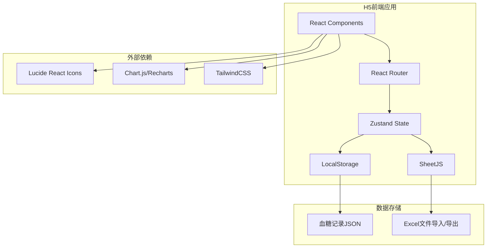

## 1. Architecture Design



## 2. Technology Description

- **Frontend**: React@18 + TypeScript + TailwindCSS@3 + Vite@6
- **State Management**: Zustand
- **Routing**: React Router DOM
- **Chart**: Recharts
- **Excel Processing**: SheetJS (xlsx)
- **Icons**: Lucide React
- **Data Storage**: LocalStorage (JSON格式)
- **Build Tool**: Vite

## 3. Route Definitions

| Route | Purpose | Component |
|-------|---------|-----------|
| `/` | 记录页面（首页） | RecordPage |
| `/records` | 显示页面（列表/表格视图） | RecordsPage |
| `/statistics` | 统计页面 | StatisticsPage |
| `/download` | 下载页面 | DownloadPage |
| `/settings` | 设置页面（数据管理） | SettingsPage |

## 4. Data Model

### 4.1 血糖记录数据模型

```typescript
type MealType = 'breakfast' | 'lunch' | 'dinner' | 'emptyStomach' | 'bedtime';
type TimePoint = 'before' | '1h' | '2h';

interface BloodSugarEntry {
  id: string;
  date: string;           // YYYY-MM-DD
  time: string;           // HH:mm
  mealType: MealType;     // 餐段类型
  timePoint: TimePoint | null; // 餐前/餐后时间点
  value: number;          // 血糖值 (mmol/L)
  food: string;           // 餐食内容
  exercise: string;       // 运动情况（预设选项或自由文本）
  status: 'normal' | 'high' | 'low'; // 血糖状态
  createdAt: number;      // 创建时间戳
}

interface AppState {
  records: BloodSugarEntry[];
  addRecord: (record: Omit<BloodSugarEntry, 'id' | 'createdAt' | 'status'>) => void;
  updateRecord: (id: string, updates: Partial<BloodSugarEntry>) => void;
  deleteRecord: (id: string) => void;
  importRecords: (records: BloodSugarEntry[]) => void;
  clearRecords: () => void;
}
```

### 4.2 餐段判断逻辑

| 时间段 | 判断结果 |
|--------|----------|
| 6:00 - 8:30 | 早餐前（空腹） |
| 8:30 - 10:30 | 早餐后1小时/2小时 |
| 11:30 - 12:30 | 午餐前 |
| 12:30 - 14:30 | 午餐后1小时/2小时 |
| 17:30 - 19:00 | 晚餐前 |
| 19:00 - 21:00 | 晚餐后1小时/2小时 |
| 21:00 - 23:00 | 睡前 |

### 4.3 血糖状态判断逻辑

```typescript
function getBloodSugarStatus(value: number, mealType: MealType, timePoint: TimePoint | null): 'normal' | 'high' | 'low' {
  if (value < 3.9) return 'low';
  
  const thresholds: Record<MealType, { normal: number; high: number }> = {
    emptyStomach: { normal: 5.1, high: 5.1 },
    breakfast: timePoint === '1h' ? { normal: 10.0, high: 10.0 } : timePoint === '2h' ? { normal: 8.5, high: 8.5 } : { normal: 5.3, high: 5.3 },
    lunch: timePoint === '1h' ? { normal: 10.0, high: 10.0 } : timePoint === '2h' ? { normal: 8.5, high: 8.5 } : { normal: 5.3, high: 5.3 },
    dinner: timePoint === '1h' ? { normal: 10.0, high: 10.0 } : timePoint === '2h' ? { normal: 8.5, high: 8.5 } : { normal: 5.3, high: 5.3 },
    bedtime: { normal: 6.7, high: 6.7 },
  };
  
  const threshold = thresholds[mealType];
  return value > threshold.high ? 'high' : 'normal';
}
```

## 5. Project Structure

```
src/
├── components/
│   ├── RecordForm.tsx          # 血糖记录表单
│   ├── RecordCard.tsx          # 记录卡片组件
│   ├── RecordTable.tsx         # 记录表格组件
│   ├── StatsCard.tsx           # 统计卡片组件
│   ├── ChartComponent.tsx      # 统计图表组件
│   ├── BottomNav.tsx           # 底部导航组件
│   └── BloodSugarInput.tsx     # 血糖输入组件（带颜色反馈）
├── pages/
│   ├── RecordPage.tsx          # 记录页面
│   ├── RecordsPage.tsx         # 显示页面
│   ├── StatisticsPage.tsx      # 统计页面
│   ├── DownloadPage.tsx        # 下载页面
│   └── SettingsPage.tsx        # 设置页面
├── hooks/
│   ├── useBloodSugarStore.ts   # Zustand状态管理hook
│   └── useLocalStorage.ts      # LocalStorage操作hook
├── utils/
│   ├── bloodSugarUtils.ts      # 血糖相关工具函数
│   ├── excelUtils.ts           # Excel导入导出工具
│   └── dateUtils.ts            # 日期处理工具
├── types/
│   └── index.ts                # TypeScript类型定义
├── App.tsx                     # 根组件
├── main.tsx                    # 入口文件
└── index.css                   # 全局样式
```

## 6. 核心功能实现

### 6.1 数据存储

- 使用LocalStorage存储JSON格式数据
- Key: `blood_sugar_records`
- 数据结构：`{ records: BloodSugarEntry[] }`

### 6.2 Excel导入

使用SheetJS解析Excel文件，按照现有表格结构（27列）解析数据：

| Excel列 | 对应字段 |
|---------|----------|
| 日期 | date |
| 空腹-时间 | emptyStomach.time |
| 空腹-血糖 | emptyStomach.value |
| 早餐+运动-早餐 | breakfast.food |
| 早餐+运动-运动 | breakfast.exercise |
| 早餐后1小时-时间 | breakfast1h.time |
| 早餐后1小时-血糖 | breakfast1h.value |
| ... | ... |

### 6.3 Excel导出

生成与原表格格式一致的Excel文件，包含所有列。

### 6.4 统计计算

```typescript
interface Statistics {
  total: number;
  normal: number;
  high: number;
  low: number;
  normalRate: number;
  abnormalRate: number;
}

function calculateStatistics(records: BloodSugarEntry[], days: number): Statistics {
  const cutoffDate = new Date();
  cutoffDate.setDate(cutoffDate.getDate() - days);
  
  const filtered = records.filter(r => new Date(r.date) >= cutoffDate);
  
  const counts = filtered.reduce((acc, r) => {
    acc.total++;
    if (r.status === 'normal') acc.normal++;
    else if (r.status === 'high') acc.high++;
    else acc.low++;
    return acc;
  }, { total: 0, normal: 0, high: 0, low: 0 });
  
  return {
    ...counts,
    normalRate: counts.total > 0 ? (counts.normal / counts.total) * 100 : 0,
    abnormalRate: counts.total > 0 ? ((counts.high + counts.low) / counts.total) * 100 : 0,
  };
}
```

## 7. 依赖列表

| 依赖 | 版本 | 用途 |
|------|------|------|
| react | ^18.2.0 | 前端框架 |
| react-dom | ^18.2.0 | DOM渲染 |
| react-router-dom | ^6.22.0 | 路由管理 |
| zustand | ^4.5.0 | 状态管理 |
| tailwindcss | ^3.4.1 | CSS框架 |
| lucide-react | ^0.314.0 | 图标库 |
| recharts | ^2.10.0 | 图表库 |
| xlsx | ^0.18.5 | Excel处理 |
| uuid | ^9.0.1 | 生成唯一ID |
